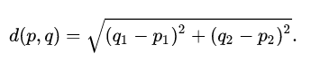

# Práctica 4 - Arrays, tuplas y enumerados

```
Autor: XueMei Lin
Curso: 20201- 2022
Universidad: Universidad de La laguna
Asignatura: Desarrollo de Sistemas Informaticos
Herramienta: Visual Studio Code
Lenguaje de programción: TypeScipt
```

## 1. Introducción
Arrays, tuplas, y enumerados es una de las partes que debemos aprender en lenguaje TypeScript. Además, en esta práctica vamos a introducir el uso de TypeDoc que sirve para convertir los comentarios en el código fuente de TypeScript en documentación HTML renderizada o un modelo JSON. Y por otro lado el funcionamiento de Mocha y Chai.

## 2. Objetivos

Como hemos mencionado antes, vamos a utilizar arrays, tuplas y enumerados para realizar uan serie de ejercicios de programación en TypeScript y además usamos TypeDoc para general una documentación HTML. Asimismo, Usaremos Mocha y Chai para hacer las comprobaciones de funciones.

## 3. Ejercicios propuestas

### 3.1. Ejercicio 1 - Tablas de multiplicar

Ejercicio 1 consiste en realizar la tabla de multiplicacion de un numero natural.

***Funcion que calcula la tabla de multiplicacion de un numero***
```
export function productTable(num: number):number[][] {

    if(num < 1) return [[-1]]
    let result:number[][] = [];
    let array:number[] = [];
    let multiple = 0;
    for(let i:number = 1; i <= num; i++) {
        array = [];
        for(let j:number = 1; j <= num; j++) {
            multiple = i * j;
            array.push(multiple)
        }
        result.push(array);
    }

    return result;
}
```

La funcion recibe un paramtro de tipo `number`, y devuelve un array de array que contiene la tabla de multiplicacion de dicho parametro.
Crea una variable `result` para almacenar la tabla y otra `array` para almacenar cada multiplicacion. Recorre desde 1 hasta el valor `num`, y realiza la multiplicacion desde 1 con dicho valor, el resultado lo guarda en un array, y dicho array lo guarda en otro array. El resultado es como una matriz que contiene una tabla de multiplicacion. 

### 3.2. Ejercicio 2 - Compresión de números en rangos

Ejercicio 2 consiste en convertir un numero dicimal a notación factorial y viceversa.

***Funcion para realizar la factorial***
```
export function fromArrayToRanges(num:number[]): string[] {
    if(num.length < 0) return ["-1"]
    if(num.length == 1) return Array.from(num[0].toString());

    let result:string[] = [];
    let concat1 = "";

    num.forEach((value, index) => {
        if(index != 0 && index!= num.length-1){
            if((num[index] == num[index-1]+1) && (num[index] == num[index+1]-1)) {
                concat1 = "";
                concat1 += num[index-1].toString();
                concat1 += "_";
                concat1 += num[index+1].toString();
                result.push(concat1);

            }else if((num[index] == num[index+1]-1) || (num[index] == num[index-1]+1)) {

            }else{
                result.push(value.toString());
            }
        }
    })

    return result;
}
```
La funcion recorre el parametro `num`, comproba que hay numeros consecutivos, si se encuentra, sustituye el valor medio a `_`, y concatena los tres numeros, y despues guarda en un nuevo array, si no se encuentra numeros consecutivos, simplemente guarda en la array.

***Funcion que convierte una notacion Factorial a Decimal***
```
export function fromRangesToArray(str:string[]):number[]{
    if(str.length < 0) return [-1]
    if(str.length == 1) return Array.from([parseInt(str[0])]);

    let num:number[] = [];
    let ValorMedio:number = 0;
    str.forEach((value, index) => {
        if(str[index].includes("_")){
            let Array = value.split("_");
            ValorMedio = (parseInt(Array[0]) + parseInt(Array[1])) / 2;
            num.push(parseInt(Array[0]));
            num.push(ValorMedio);
            num.push(parseInt(Array[1]));
        }else{
            num.push(parseInt(value));
        }
    })
    return num;
}
```
La funcion `fromRangesToArray` recorre el parametro `str`, si se encuentra una cadena que contiene `_`, entonces se separa los numeros que esta izquierda y derecha de `_`, y realiza la converticion de tipo de variable, y lo guarda en un array nuevo. En otro caso, guarda directamente el numero.


### 3.3. Ejercicio 3 - Decodificar resistencias

Ejercicio 3 consisste en calcular el valor de una resistencia sin tener que memorizar los valores de las bandas.

***Funcion que decodifica resistencias***
```
export function decodeResistor(...params:string[]):string{
    let map = new Map<string, string>()
        map.set('negro', "0")
        map.set('marron', "1")
        map.set('rojo', "2")
        map.set('naranja', "3")
        map.set('amarillo', "4")
        map.set('verde', "5")
        map.set('azul', "6")
        map.set('violeta', "7")
        map.set('gris', "8")
        map.set('blanco', "9")

    let result:string = "";
    result += map.get(params[0]) as string;
    result += map.get(params[1]) as string;

    return result;
}
```

En la funcion puede recibir parametros de tipo `string[]`, no hay limitacion de parametros. Usando el metodo que proporciona typescrit `Map`, se puede crear una variable de tipo `<string y string>`, donde el primer string representa colores y el segundo representa los numeros que correpondientes. La varibale `result` concatenan las letras de numeros que correpondientes cada parametro.


### 3.4. Ejercicio 4 - Palabras encadenadas en un array

Ejercicio 4 consiste en comprobar que las palabras del array están encadenadas.

```
export function meshArray(cadenasString: string[]) {
    let resultEje2: string = "";
    let palabra: string = "";
    let palabraSiguiente: string = "";
    let posicion: number = 0;
    let posicionpalabraSiguiente: number = 0;
    for(let i: number = 0; i < cadenasString.length - 1; i++) {
        //asignar a letras nuevas
        palabra = cadenasString[i];
        palabraSiguiente = cadenasString[i + 1];
        //asignar a posiciones nuevas
        posicion = palabra.length - 1;
        posicionpalabraSiguiente = 0;
        while (palabra[posicion] != palabraSiguiente[posicionpalabraSiguiente]) {
            posicion--;
            if (posicion <= 0) {
                return -1;
            }
        }
        for (let j: number = posicion; j < palabra.length; j++) {
            if (palabra[j] == palabraSiguiente[posicionpalabraSiguiente]) {
                resultEje2 = resultEje2 + palabra[j];
                posicionpalabraSiguiente++;
            } else {
                return -1;
            }
        }
    }
    return resultEje2;
}
```
En la implementación de la función meshArray lo que hace recorrer el array dado, comparar la letra que esta en la i posición del array, encuentra letras iguales, guarda en el resultado, en el caso contrario, devuelve un `-1`;


### 3.5. Ejercicio 5 - Calcular la media y concatenar cadenas

Ejercicio 5 consiste en calcular la media y concatenar cadenas

***Funcion que calcula la media de todos los numeros y concatenar cadenas***
```
export function meanAndConcatenate(arrayNyC: string[]):string[]{
    let sum: number = 0;
    let count: number = 0;
    let newArrayEje3: string[] = [];
    let newstring: string = "";
    let result: string[] = [];
    for(let i :number = 0; i < arrayNyC.length; i++) {
        if((/[0-9]/g).test(arrayNyC[i])){
            sum += parseInt(arrayNyC[i]);
            count++;
        }else{
            newstring += arrayNyC[i];
        }
    }
    sum = sum /count;
    let media: string = sum.toString();
    result.push(media);
    result.push(newstring);
    
    return result;
}
```
La funcion recibe `arrayNyC` como parametro, es un array de tipo `string` que contiene numeros y caracteres, en la funcion recorremos el array, si encontramos un numero, lo sumamos, en caso contrario, guardamos en una variable creada `newstring`, y luego hacemos la media de todos los numeros `sum`, asi obtenemos la media y cadena de caracteres.

### 3.6. Ejercicio 6 - Mover los ceros al final

Ejercicio 6 consiste en mover todos los ceros al final

***Funcion que mueve los ceros al final***
```
export function moveZeros(array:number[]):number[]{
    let count: number = 0;
    let newArray: number[] = [];
    array.forEach((number) => {
        if(number == 0) {
            count++;
        }else{
            newArray.push(number);
        }
    })

    for(let i:number = 0; i < count; i++) {
        newArray.push(0);
    }
    
    return newArray;
}
```
La funcion recibe un array de tipo `number[]`, que contiene distintos numeros, recorre el array, si encontramos un 0, aumentamos el contador, en otro caso lo guardamos en una nueva array `newArray`, y al final añadimos los `0` con `count` ( las veces de 0 que hay ) veces.

### 3.7. Ejercicio 7 - Factoría de multiplicaciones

Ejercicio 7  consiste en devolver como resultado otra función que toma como argumento un único valor numérico y devuelve un nuevo array. El array devuelto por la segunda función debe ser el resultado de la multiplicación de los números del array por el valor numérico que recibe la segunda función. Además, no se debe modificar el primer array.

***Funcion que realiza la fatoria de multiplicaciones***
```
export function multiplyAll(array:number[]) {
    return function(num:number):number[] {
        let newArray:number[] = [];
        array.forEach((value)=>{
            newArray.push(value * num);
        })
        return newArray;
    }
}
```
La funcion `multiplyAll` devuelve la funcion `function` que realiza el recorre del parametro `array` para calcular cada valor multiplicando por `num`. Y luego la funcion `function` devuelve un nuevo array que contiene el resultado.

### 3.8. Ejercicio 8 - Puntos bi-dimensionales

Ejercicio 8 consiste en realizar suma, resta, producto y la distancia euclidea de dos puntos de 2 dimensiones.

***Creacion de tipo de datos de un punto de 2 dimensiones***
```
// Define a type of pointer;
type pointer2D = [number, number];
```
Creamos un tipo de dato `pointer2D` para un punto de 2 dimensiones.

***Funcion que suma dos puntos de 2D***
```
export function add(punto1_2D:pointer2D, punto2_2D:pointer2D):pointer2D{
    return [punto1_2D[0] + punto2_2D[0], punto1_2D[1] + punto2_2D[1]];
}
```
Realiza la suma de la posicion 0 de dos puntos y la suma de la posicion 1 de dos puntos.

***Funcion que suma dos puntos de 2D***
```
export function subtraction(punto1_2D:pointer2D, punto2_2D:pointer2D):pointer2D {
    return [punto2_2D[0] - punto1_2D[0], punto2_2D[1] - punto1_2D[1]];
}
```
Realiza la resta de la posicion 0 de dos puntos y la suma de la posicion 1 de dos puntos.

***Funcion que hace producto de un punto de 2 dimeniones con un numero***
```
export function product(punto1_2D:pointer2D, prod:number):pointer2D {
    return [punto1_2D[0] * prod, punto1_2D[1] * prod]
}
```
Realiza el producto de un punto (posicion 0 y posicion 1) con un numero.

***Funcion que calcula la distancia euclidiana de dos puntos de 2D***
```
export function euclideanDistance(punto1_2D:pointer2D, punto2_2D:pointer2D) {
    let d_XeY = Math.pow((punto1_2D[0]-punto2_2D[0]),2) + Math.pow((punto1_2D[1]-punto2_2D[1]),2);
    return Math.sqrt(d_XeY).toFixed(2);
}
```
[Distancia euclidiana](https://en.wikipedia.org/wiki/Euclidean_distance) entre dos puntos se calcula mediante la siguiente formula:



Por lo tanto, usando los metodos `Math.pow()` y `Math.sqrt()` que proporciona typscript podemos calcular facilmente la distancia euclidiana.


### 3.9. Ejercicio 9 - Puntos n-dimensionales

Ejercicio 9 consiste en realizar suma, resta, producto y la distancia euclidea de dos puntos de n dimensiones.

***Creacion de tipo de datos de un punto de n dimensiones***
```
// user assert function
import { assert } from "chai";

type pointerND = [number, number, number,...number[]];
```
Igual que el ejericio 08, la unica diferencia es que definimos un tipo de variable `pointerND` para un punto de `n` dimensiones.

***Funcion que suman dos puntos de n dimeniones***
```
export function add(p1:pointerND, p2:pointerND):pointerND {
    assert(p1.length == p2.length)
    let resultAddPoints:pointerND = [0, 0, 0];

    p1.forEach((value, index)=>{
        resultAddPoints[index] = value + p2[index];
    })

    return resultAddPoints;
}
```

***Funcion que restan dos puntos de n dimeniones***
```
export function subtraction(p1:pointerND, p2:pointerND):pointerND {
    assert(p1.length == p2.length)
    let resultSubPoints:pointerND = [0, 0, 0];

    p2.forEach((value, index) => {
        resultSubPoints[index] = value - p1[index];
    })

    return resultSubPoints;
}
```

***Funcion que hace producto de un punto de n dimeniones con un numero***
```
export function product(p1:pointerND, prod:number):pointerND {
    let resultProPoints:pointerND = [0, 0, 0];

    p1.forEach((value, index)=> {
        resultProPoints[index] = value * prod;
    })

    return resultProPoints;
}
```

***Funcion que calcula la distancia euclidiana de dos puntos de n dimensiones***
```
export function euclideanDistance(p1:pointerND, p2:pointerND) {
    assert(p1.length == p2.length)

    let sum = 0;
    p1.forEach((value, index) => {
        sum += Math.pow(value - p2[index], 2);
    })
    return parseFloat(Math.sqrt(sum).toFixed(2));
}
```


### 3.10. Ejercicio 10 - El Cartesiano

Ejercicio 10 consiste en calcular un paseo corte de usuario A que cumple ciertos requisitos.

***Funcion que calcula un paseo corte si es valido o no***
```
export function shortWalk(appRide:string[]) :boolean {
    assert(appRide.length != 0)

    let count = 0;
    let posActualI = 0;
    let posActualJ = 0;

    appRide.forEach((value) =>{
        switch(value) {
            case 'n':
                posActualI++;
                break;

            case 's':
                posActualI--;
                break;

            case 'e':
                posActualJ--;
                break;

            case 'o':
                posActualJ++;
                break;

            default:
                return false;
        }
        count++;
    })
    if(count == 10 && posActualI == 0 && posActualJ == 0){
        return true
    }
    return false;
}
```
La funcion recibe un parametro `appRide` de tipo `string[]`, que contiene de manera aleatoriao los siguientes elementos: `[‘n’, ‘s’, ‘e’, ‘o’]`. Primero del todo, hay que comprobar que el usuario A esta no esta quieto (en la posicion donde esta el usuario A). Luego depende de la direccion que se encuentra, mueve hascia la direccion correspondiente. Si tras 10 movimientos, vuelve a la posicion inicial, pues cumple los requisitos y es un paseo corto y valido.


## 4. Utilizacion de Mocha, Chai y TypeDoc
En esta practica, tambien se utilzia Mocha, Chai, y TypeDoc para mejorar nuestro "proyecto".
[Mocha](https://mochajs.org/)
[Chai](https://www.chaijs.com/)
[TypeDoc](https://typedoc.org/)

La siguiente es la demostracion de los tests para cada ejercicio.

 

